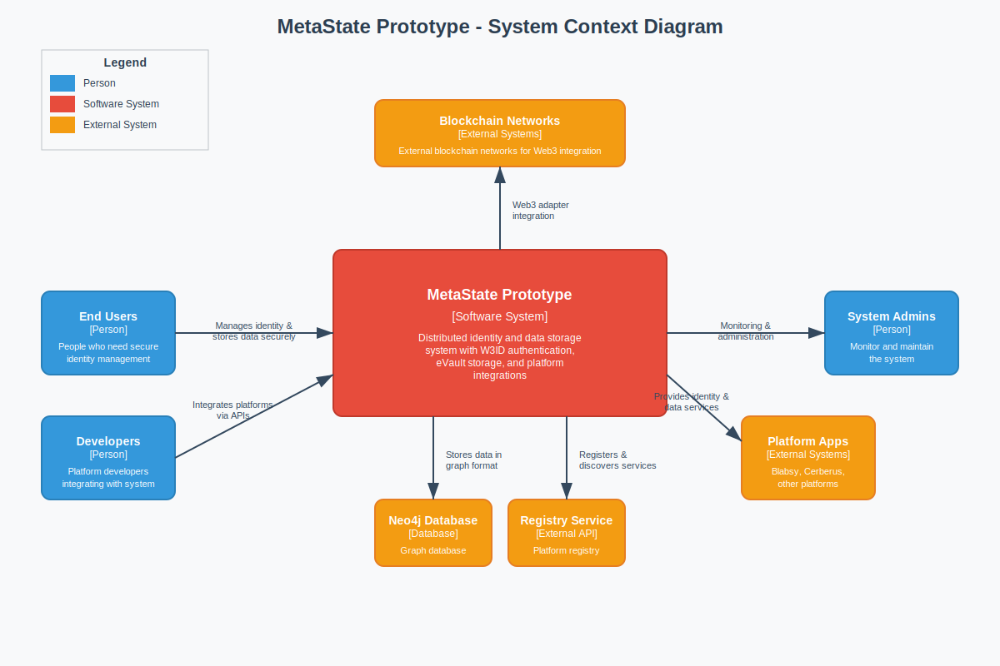

# System Context Diagram

[← Back to Architecture Documentation](../README.md)

## Overview

Shows the high-level view of the MetaState Prototype system in its environment, including:
- External users (End Users, Developers, System Administrators)
- External systems (Neo4j Database, Registry Service, Blockchain Networks, Platform Applications)
- The MetaState Prototype system as a single entity

## Diagram

---
[← Back to Architecture Documentation](../README.md)
