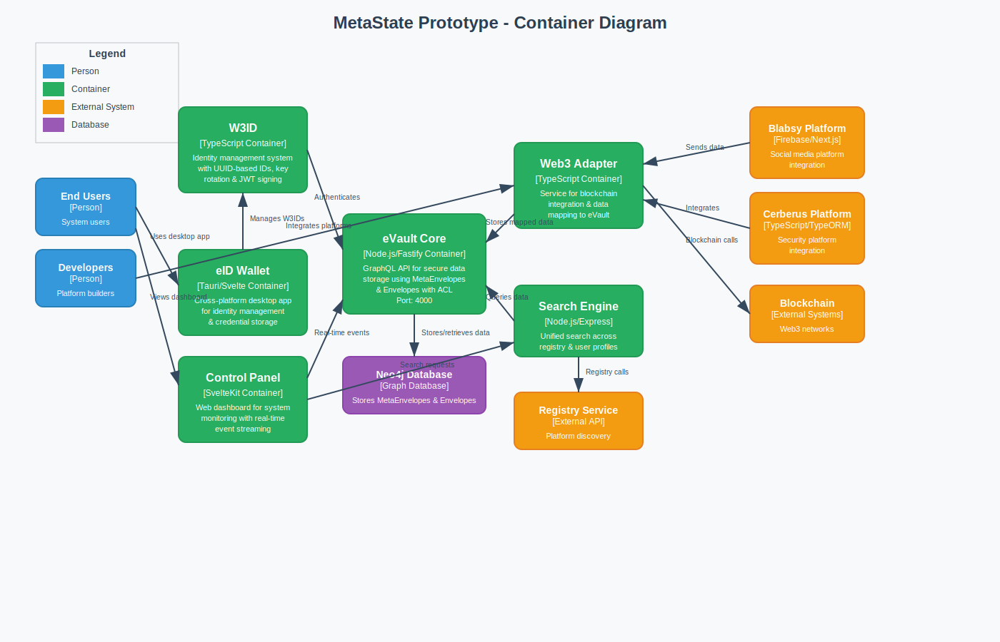

# Container Diagram

[← Back to Architecture Documentation](../README.md)

## Overview

Zooms into the MetaState system to show the major containers (applications and databases):
- **W3ID**: TypeScript-based identity management system
- **eVault Core**: Node.js/Fastify GraphQL API for secure data storage
- **eID Wallet**: Tauri/Svelte cross-platform desktop application
- **Control Panel**: SvelteKit web dashboard for system monitoring
- **Web3 Adapter**: TypeScript service for blockchain integration
- **Search Engine**: Node.js/Express unified search service

## Diagram

---
[← Back to Architecture Documentation](../README.md)
