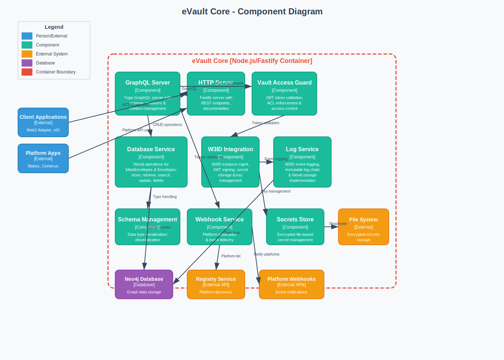

# Component Diagram - eVault Core

[← Back to Architecture Documentation](../README.md)

## Overview

Detailed view of the eVault Core container showing its internal components:
- **GraphQL Server**: Yoga GraphQL server with schema and resolvers
- **HTTP Server**: Fastify server with REST endpoints and documentation
- **Vault Access Guard**: JWT validation and ACL enforcement
- **Database Service**: Neo4j operations for MetaEnvelopes and Envelopes
- **W3ID Integration**: W3ID instance management and JWT signing
- **Log Service**: W3ID event logging with immutable log chains
- **Schema Management**: Data serialization/deserialization
- **Webhook Service**: Platform notification system
- **Secrets Store**: Encrypted file-based secret management

## Diagram

---
[← Back to Architecture Documentation](../README.md)
