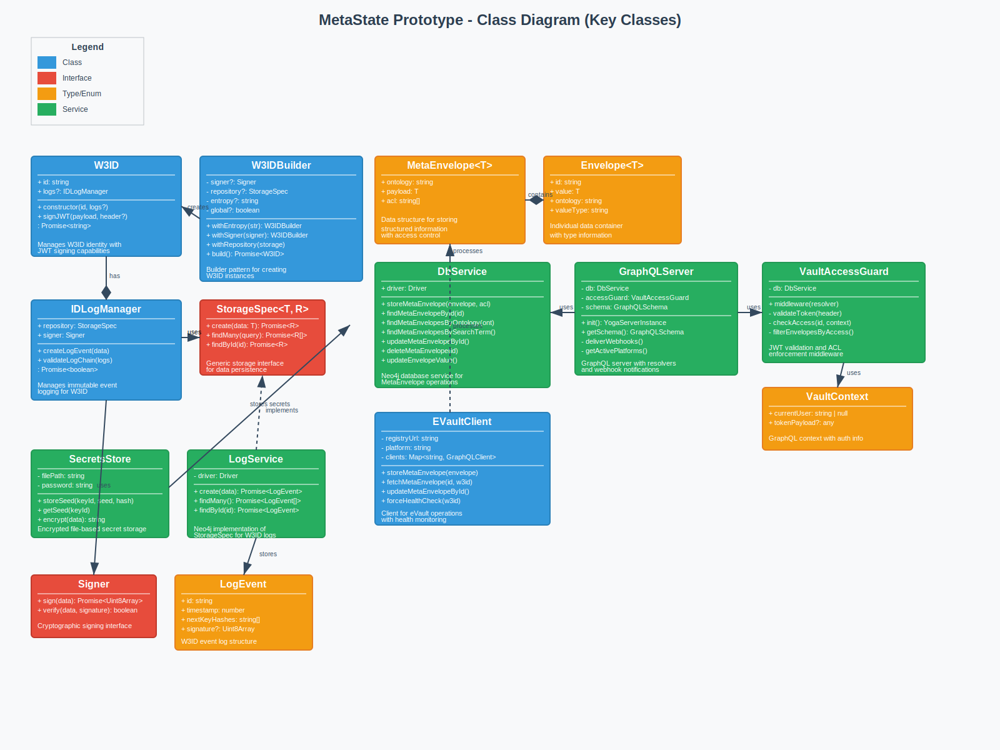

# Class Diagram

[← Back to Architecture Documentation](../README.md)

## Overview

Shows the key classes and their relationships in both W3ID and eVault Core systems:

### W3ID Core Classes:
- **W3ID**: Main identity class with JWT signing capabilities
- **W3IDBuilder**: Builder pattern for creating W3ID instances
- **IDLogManager**: Manages immutable event logging
- **StorageSpec\<T, R\>**: Generic storage interface
- **LogService**: Neo4j implementation of StorageSpec
- **SecretsStore**: Encrypted secret management

### eVault Core Classes:
- **MetaEnvelope\<T\>**: Data structure with ontology and ACL
- **Envelope\<T\>**: Individual data container with type information
- **DbService**: Neo4j database operations
- **GraphQLServer**: GraphQL server with webhook support
- **VaultAccessGuard**: Authentication and authorization middleware
- **EVaultClient**: Client for eVault operations with health monitoring

### Supporting Types and Interfaces:
- **Signer**: Cryptographic signing interface
- **LogEvent**: W3ID event log structure
- **VaultContext**: GraphQL context with authentication info

## Diagram

---
[← Back to Architecture Documentation](../README.md)
