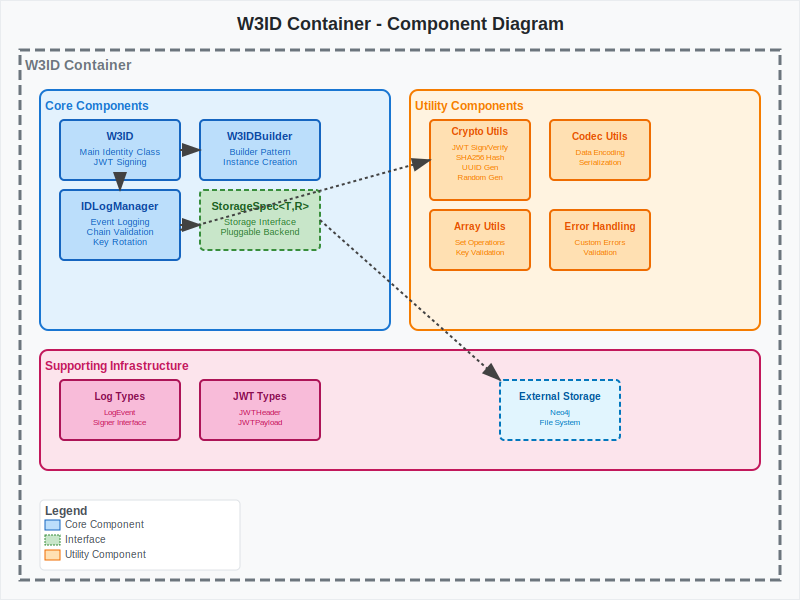

# Component Diagram - W3ID

[← Back to Architecture Documentation](../README.md)

## Overview

Detailed view of the W3ID container showing its internal components for identity management:

### Core Components:
- **W3ID**: Main identity class providing JWT signing capabilities and identity operations
- **W3IDBuilder**: Builder pattern implementation for creating W3ID instances with various configurations
- **IDLogManager**: Manages immutable event logging, key rotation, and cryptographic validation of log chains
- **StorageSpec Interface**: Generic storage abstraction allowing pluggable storage backends

### Utility Components:
- **Cryptographic Utils**: JWT signing/verification, SHA256 hashing, UUID generation (v4/v5), and secure random generation
- **Codec Utils**: Data encoding/decoding utilities for consistent data serialization
- **Array Utils**: Set operations for key validation and comparison during log chain validation

### Supporting Infrastructure:
- **Error Handling**: Custom error types for validation failures, malformed chains, and signature verification
- **Log Types**: TypeScript interfaces for LogEvent, Signer, and JWT structures

## Key Features:
- **Immutable Event Logging**: All identity operations are logged in cryptographically linked chains
- **Key Rotation**: Secure key rotation with forward-declared next key hashes
- **JWT Integration**: Native JWT signing and verification with configurable algorithms
- **Pluggable Storage**: Support for different storage backends through StorageSpec interface
- **Builder Pattern**: Flexible identity creation with optional entropy, namespaces, and repositories

## Diagram

---
[← Back to Architecture Documentation](../README.md)
