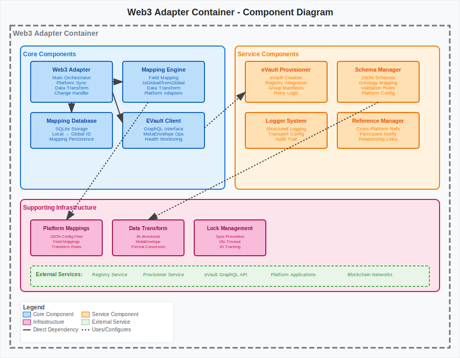

# Component Diagram - Web3 Adapter

[← Back to Architecture Documentation](../README.md)

## Overview

Detailed view of the Web3 Adapter container showing its internal components for blockchain and platform integration:

### Core Components:
- **Web3 Adapter**: Main orchestrator class managing platform data synchronization with eVaults
- **Mapping Engine**: Transforms platform-specific data to/from universal MetaEnvelope format using configurable field mappings
- **Mapping Database**: SQLite-based persistence layer storing local-to-global ID mappings for data synchronization
- **EVault Client**: GraphQL client interface providing operations for storing, updating, and referencing MetaEnvelopes

### Service Components:
- **eVault Provisioner**: Handles creation and configuration of new eVaults through registry and provisioner services
- **Schema Manager**: Manages JSON schema mappings and validation rules for different platform data structures
- **Logger System**: Structured logging infrastructure with configurable transports for audit and debugging

### Supporting Infrastructure:
- **Platform Mappings**: JSON-based configuration files defining field mappings and transformation rules per platform
- **Data Transformation**: Bidirectional conversion between platform formats and universal MetaEnvelope structures
- **Reference Management**: Handles cross-platform data references and participant notifications

## Key Features:
- **Multi-Platform Support**: Configurable adapters for different blockchain and web platforms
- **Bi-Directional Sync**: Real-time synchronization of data changes between platforms and eVaults
- **Schema Validation**: Ensures data integrity through ontology-based schema validation
- **Reference Linking**: Maintains relationships between data across different platforms and eVaults
- **Audit Logging**: Comprehensive logging of all data transformations and synchronization operations

## Diagram

---
[← Back to Architecture Documentation](../README.md)
