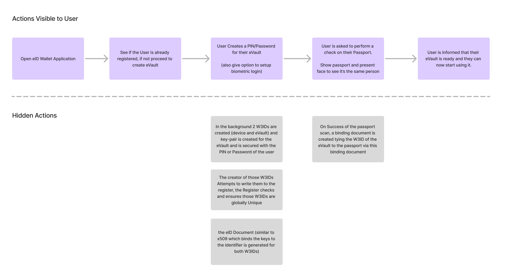
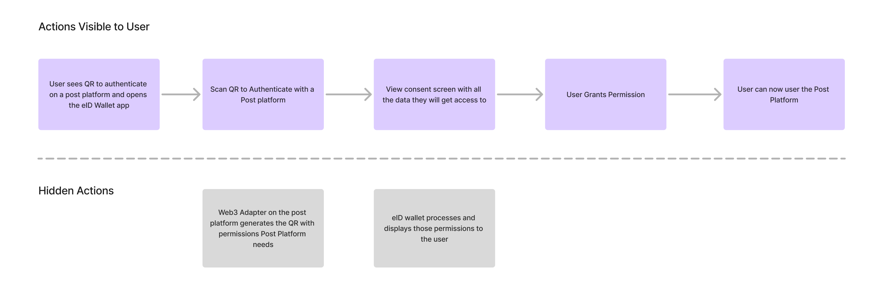
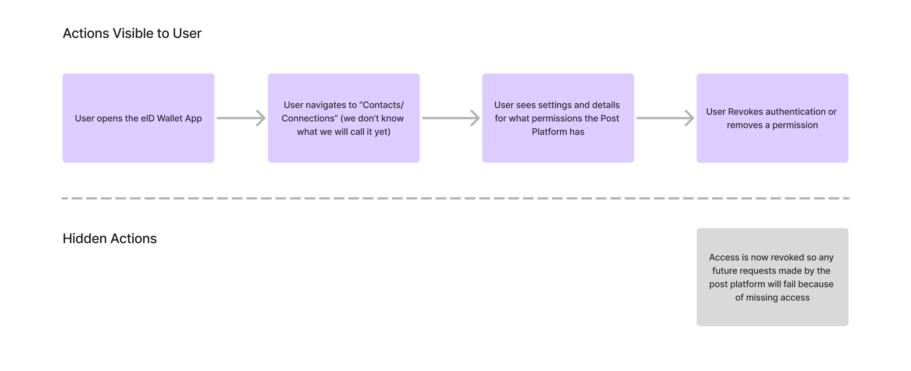
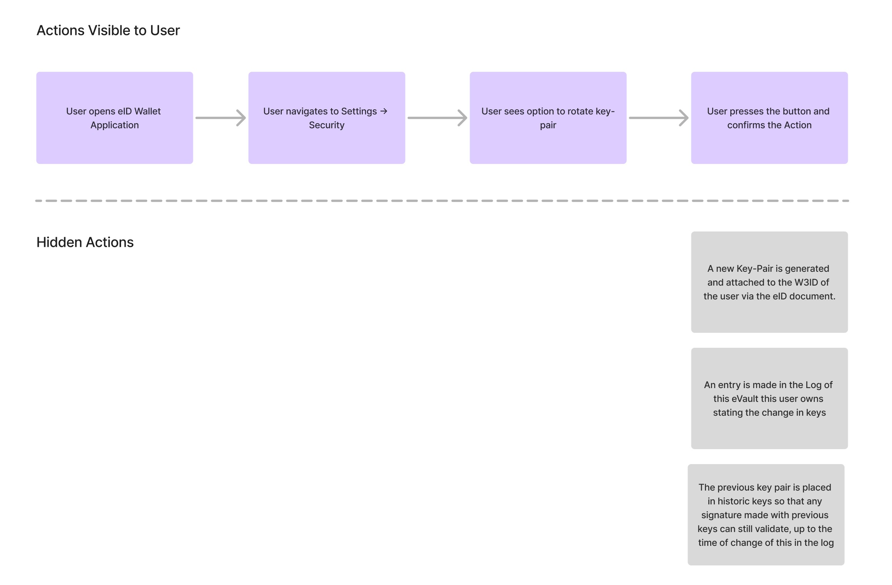
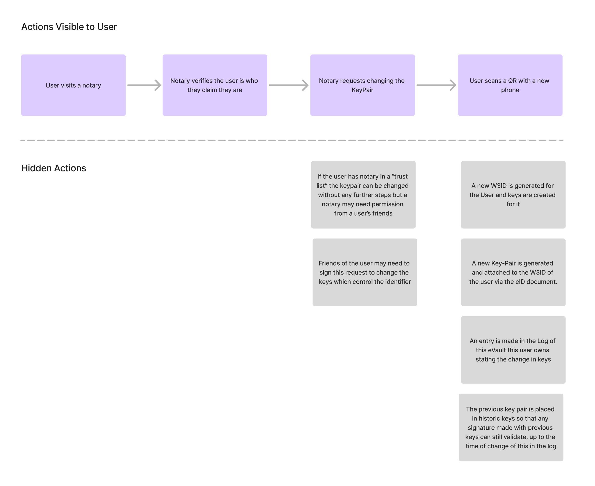

# eID Wallet

The eID wallet service will be a mobile application which uses the secure cryptographic enclaves (the special cryptographic engine in the phone which creates and manages keys without letting the private one out) present on modern mobile phones to store and manage the Device ID. The mobile wallet will also be the UI touchpoint for the creation of a eVault and eID binding process, wallet key management, and for a user to access and interact with

## Technical Requirements

- Verifying a user's identity and generating eVaults
- Authenticating users with Post Platforms
- Storing the keypair which controls the eVault
- Allowing a user to change the keypair in case of a security incidence
- Allowing user to revoke authentication with a platform if they want
- Display permissions given to a post platform

## User Journeys

### Onboarding a user and creating an eVault

### Authenticating with a Post Platform

### Revoking Authentication with a Post Platform

### Key Rotation initiated by User

### Key Rotation requested by Notary

# Tauri + SvelteKit + TypeScript

This template should help get you started developing with Tauri, SvelteKit and TypeScript in Vite.

## Recommended IDE Setup

[VS Code](https://code.visualstudio.com/) + [Svelte](https://marketplace.visualstudio.com/items?itemName=svelte.svelte-vscode) + [Tauri](https://marketplace.visualstudio.com/items?itemName=tauri-apps.tauri-vscode) + [rust-analyzer](https://marketplace.visualstudio.com/items?itemName=rust-lang.rust-analyzer).
