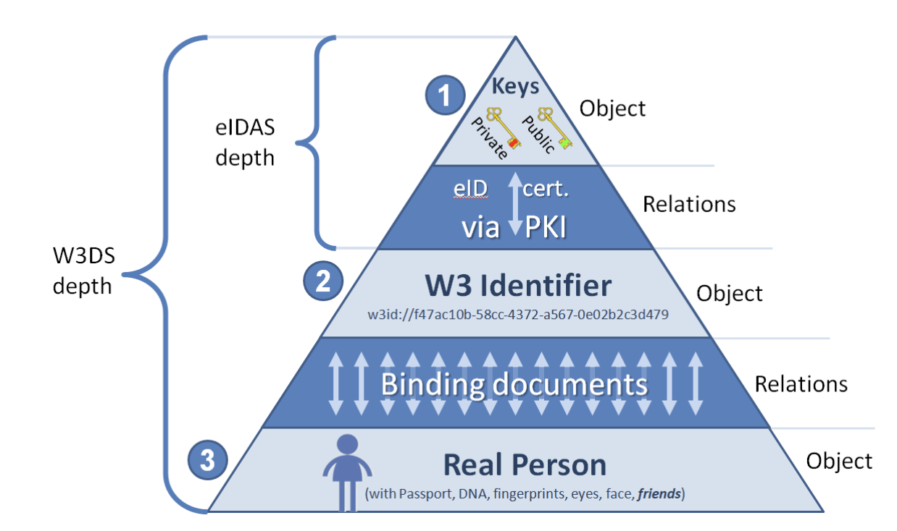

# W3ID

The metastate ecosystem has the only 1 type of identifiers, W3ID (did:w3id protocol, defined below) for all types of entities, e.g..

## Where is it used

### _Users & Groups_

Users and groups would have a persistent, unchanging identifier which is referred to as Web 3 Identifier
In case of a person, the W3ID is the life-long anchor which connects keys and the physical essence of a person. It is represented on the diagram below
(1-2 relations) personal W3ID and personal keys via eID certificate from PKI
(2-3 relations) personal W3ID and body characteristics, physical passport and friends.

### _Mobile Devices (or Device ID)_:

Mobile devices would use a persistent (within the lifetime of the device) W3ID identifier within the ecosystem.
eVault: An eVault would use its own unique W3ID, which is not shared with a user, but rather is used internally to sync data between clone eVaults and used internally by an eVault hosting provider.

### _W3 Envelope_

W3 Envelope would use a W3ID, which is globally unique, and this W3ID would be used in the W3ID URI scheme to retrieve a envelope.

## Technical Requirements and Guarantees:

- The identifier must be globally persistent, and unique.
- The identifier must exist on a namespace with more range higher than 10^22
- The identifier must support rotation of secrets and must only be loosely bound to keys
- The identifier must be loosely tied to a passport in form of binding document

## W3ID URI Scheme

### W3ID URI format:

`@<UUID in HEX>` (case insensitive, like any URI) formed by the rules of [RFC4122](https://datatracker.ietf.org/doc/html/rfc4122). In particular, the number and positioning of the dashes in the string is mandatory!
UUID range is 2^122 or 15 orders larger than expected amount of IDs (10^22) therefore it fits the purpose perfectly.

### Example:

`@e4d909c2-5d2f-4a7d-9473-b34b6c0f1a5a`
If a local ID is needed, it is added after “/”, also as UUID range e.g.:
`@e4d909c2-5d2f-4a7d-9473-b34b6c0f1a5a/f2a6743e-8d5b-43bc-a9f0-1c7a3b9e90d7`
which means “the object `f2a6743e-8d5b-43bc-a9f0-1c7a3b9e90d7` at the eVault `e4d909c2-5d2f-4a7d-9473-b34b6c0f1a5a`,
where `e4d909c2-5d2f-4a7d-9473-b34b6c0f1a5a` could be:
either the exact URL of the eVault, or
the URL of its “controller”, the owner, then such URL should be resolved to the current eVault which this person (or group) controls

## W3ID Key binding

The Identifier would be loosely bound to a set of keys, meaning an identifier is not derived from a set of keys making it easy to change the keys in case someone's keys gets compromised, or they turn up on the beach naked and need a new set of keys as their device is lost.

### Additional Considerations

#### Friend Based Recovery

2-3 Friends may verify the identity of a person to recover lost metastate ID on the eVault. This would be based on a trust list which a person can create while they do still have access to their keys. This trust list by default would have a list of all notaries in the ecosystem but the user may modify it and add people who always need to approve the action of changing keys at their end as well. 

So for example a user "Jack" says I trust the notary but I also want "Bob" to approve the action each time a notary tries to change the keys which are controlled by Jack.

#### Migration of eVault

In the implementation it must be ensured that the file is still accessible regardless of the eVault it is stored in. This can be done via recording also-known-as records in the register for an eVault each time someone migrates their eVault. For example if a user migrates  evault `e4d909c2-5d2f-4a7d-9473-b34b6c0f1a5a` to `f2a6743e-8d5b-43bc-a9f0-1c7a3b9e90d7`, the register will store an entry pointing all requests to `e4d909c2-5d2f-4a7d-9473-b34b6c0f1a5a` to be redirected to `f2a6743e-8d5b-43bc-a9f0-1c7a3b9e90d7`

## W3ID Document Binding

The identifier would be also loosely bound to a Passport, via a binding document certified by a root CA in the prototype, where the Identifier would be connected to entropy generated by the details of the passport of an individual.

> Note: Passport verification is out of scope for W3ID as an identifier and is handled by the eID Wallet Applicaiton.
